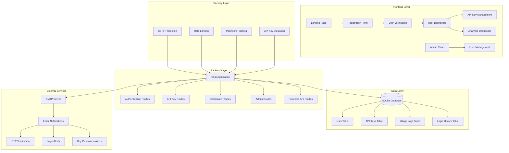
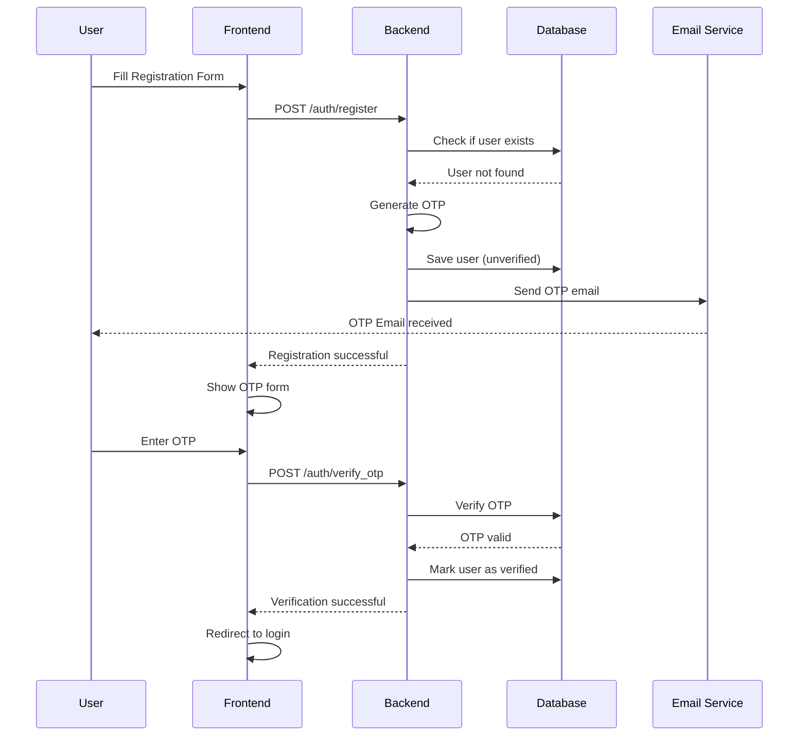
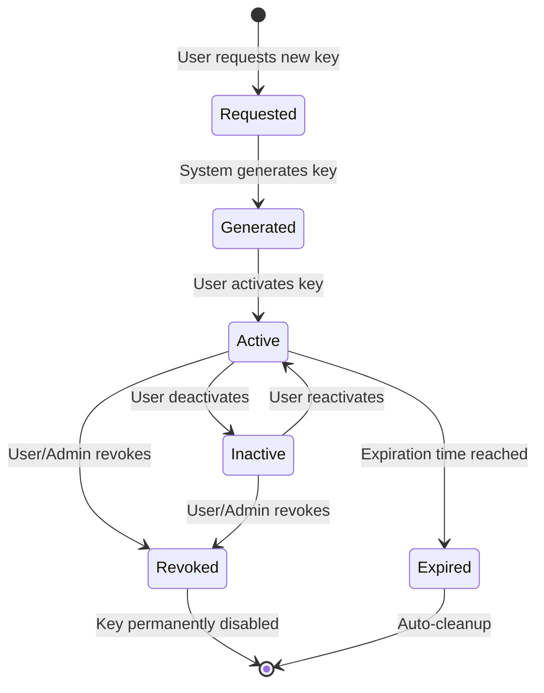
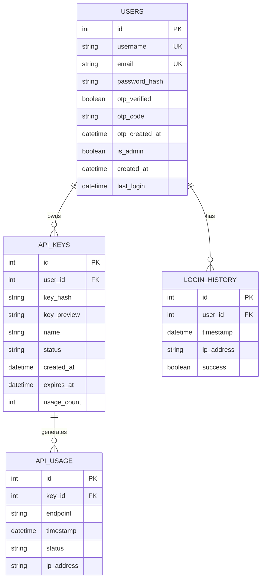
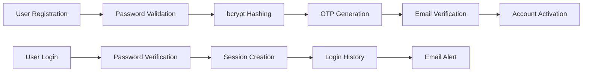

# 🔐 API Manager - Advanced API Key Management System

<div align="center">
  
  
  
  
</div>

## 📋 Table of Contents

- [🎯 Overview](#-overview)
- [🏗️ System Architecture](#-system-architecture)
- [🔧 Features](#-features)
- [🛠️ Tech Stack](#-tech-stack)
- [📊 Database Schema](#-database-schema)
- [🚀 Quick Start](#-quick-start)
- [🔒 Security Features](#-security-features)
- [📧 Email Configuration](#-email-configuration)
- [🎨 UI/UX Features](#-uiux-features)
- [📱 API Documentation](#-api-documentation)
- [🚀 Deployment](#-deployment)
- [📈 Performance](#-performance)
- [🧪 Testing](#-testing)
- [🤝 Contributing](#-contributing)

## 🎯 Overview

A comprehensive, production-ready API key management system built with Flask, featuring advanced security, real-time analytics, and modern UI. Perfect for managing API access, tracking usage, and maintaining secure authentication workflows.

## 🏗️ System Architecture



### 🔄 User Registration Flow



### 🔐 API Key Lifecycle



## 🔧 Features

### 🔐 **Authentication & Security**
- ✅ **Email OTP Verification** - Secure 6-digit OTP with expiration
- ✅ **Password Security** - bcrypt hashing with configurable rounds
- ✅ **Rate Limiting** - Configurable limits per endpoint
- ✅ **CSRF Protection** - Token-based CSRF validation
- ✅ **Session Management** - Secure session handling
- ✅ **Input Validation** - Server-side validation for all inputs

### 🗝️ **API Key Management**
- ✅ **Secure Generation** - 128+ character cryptographically secure keys
- ✅ **SHA256 Hashing** - Keys hashed before database storage
- ✅ **Status Management** - Active/Inactive/Revoked states
- ✅ **Expiration Support** - Optional key expiration dates
- ✅ **Usage Tracking** - Comprehensive request logging
- ✅ **Key Naming** - Optional descriptive names for keys

### 📧 **Email Notifications**
- ✅ **OTP Verification** - Styled HTML emails with OTP codes
- ✅ **Login Alerts** - Security notifications for new logins
- ✅ **Key Generation** - Notifications for new API keys
- ✅ **SMTP Support** - Gmail, Outlook, and custom SMTP servers

### 📊 **Analytics & Monitoring**
- ✅ **Real-time Dashboards** - Interactive charts with Chart.js
- ✅ **Usage Statistics** - Request counts, success rates, error tracking
- ✅ **Login History** - IP tracking and login timestamps
- ✅ **Admin Analytics** - System-wide statistics and user management

### 🎨 **Modern UI/UX**
- ✅ **Responsive Design** - Mobile-first with Tailwind CSS
- ✅ **Interactive Animations** - Smooth transitions and micro-interactions
- ✅ **Dark/Light Theme Support** - Automatic theme detection
- ✅ **Real-time Updates** - Live statistics without page refresh

## 🛠️ Tech Stack

### **Backend**
- **Flask 2.3.3** - Modern Python web framework
- **SQLAlchemy** - ORM with database abstraction
- **Flask-Login** - User session management
- **Flask-Mail** - Email integration
- **Flask-Limiter** - Rate limiting
- **bcrypt** - Password hashing
- **python-dotenv** - Environment configuration

### **Frontend**
- **HTML5/CSS3** - Modern semantic markup
- **Tailwind CSS** - Utility-first styling
- **JavaScript ES6+** - Modern JavaScript features
- **Chart.js** - Interactive data visualization
- **Font Awesome** - Icon library

### **Database**
- **SQLite** - Development database (upgradeable to PostgreSQL)
- **Indexes** - Optimized queries
- **Relationships** - Proper foreign key constraints

### **Security**
- **CSRF Tokens** - Cross-site request forgery protection
- **Rate Limiting** - DDoS and abuse prevention
- **Input Sanitization** - XSS prevention
- **Secure Headers** - Additional security headers

## 📊 Database Schema



### **Table Relationships**
- **Users** → **API Keys**: One-to-Many (User can have multiple API keys)
- **Users** → **Login History**: One-to-Many (Track all login attempts)
- **API Keys** → **Usage Logs**: One-to-Many (Track all API requests)

## 🚀 Quick Start

### **Prerequisites**
- Python 3.11 or higher
- Git
- SMTP email account (Gmail recommended)

### **Installation Steps**

1. **Clone the Repository**
   ```bash
   git clone https://github.com/ubvc04/Custom-API-Management.git
   cd Custom-API-Management
   ```

2. **Create Virtual Environment**
   ```bash
   python -m venv venv
   
   # Windows
   venv\Scripts\activate
   
   # Linux/Mac
   source venv/bin/activate
   ```

3. **Install Dependencies**
   ```bash
   pip install -r requirements.txt
   ```

4. **Environment Configuration**
   ```bash
   cp .env.example .env
   # Edit .env with your settings
   ```

5. **Configure Email Settings**
   ```env
   SMTP_USERNAME=your-email@gmail.com
   SMTP_PASSWORD=your-app-password
   SECRET_KEY=your-super-secret-key
   ```

6. **Initialize Database**
   ```bash
   python app.py
   # Database will be created automatically
   ```

7. **Access Application**
   ```
   http://localhost:5000
   ```

### **First Time Setup**

1. **Register First User** (becomes admin automatically)
2. **Verify Email** with OTP code
3. **Login** and explore the dashboard
4. **Generate API Key** for testing
5. **Test API Endpoints** with your new key

## 🔒 Security Features

### **Authentication Security**


### **API Key Security**
- **Cryptographic Generation**: Using `secrets.token_urlsafe()`
- **SHA256 Hashing**: Keys never stored in plain text
- **Preview Only**: Only first 16 characters shown in UI
- **Automatic Expiration**: Optional time-based expiration
- **Usage Tracking**: Every request logged with metadata

### **Application Security**
- **Rate Limiting**: Configurable per-endpoint limits
- **CSRF Protection**: Token-based validation
- **Input Sanitization**: XSS prevention
- **SQL Injection Protection**: SQLAlchemy ORM
- **Secure Headers**: HTTPS enforcement in production

## 📧 Email Configuration

### **Gmail Setup (Recommended)**

1. **Enable 2FA** on your Google account
2. **Generate App Password**:
   - Go to Google Account Settings
   - Security → 2-Step Verification
   - App passwords → Generate password for "Mail"
3. **Configure Environment**:
   ```env
   SMTP_SERVER=smtp.gmail.com
   SMTP_PORT=587
   SMTP_USERNAME=your-email@gmail.com
   SMTP_PASSWORD=your-app-password
   SMTP_USE_TLS=True
   ```

### **Custom SMTP Setup**

```env
SMTP_SERVER=your-smtp-server.com
SMTP_PORT=587
SMTP_USERNAME=your-username
SMTP_PASSWORD=your-password
SMTP_USE_TLS=True
```

### **Email Templates**

The system includes professionally designed HTML email templates:

- **🔐 OTP Verification**: Clean, branded verification emails
- **🚨 Login Alerts**: Security notification with IP and timestamp
- **🔑 API Key Notifications**: New key generation alerts

## 🎨 UI/UX Features

### **Design System**
- **Color Palette**: Purple gradient primary, semantic colors
- **Typography**: Clean, hierarchical text styles
- **Spacing**: Consistent 8px grid system
- **Animations**: Smooth micro-interactions

### **Responsive Breakpoints**
```css
/* Mobile First Design */
sm: 640px   /* Small devices */
md: 768px   /* Medium devices */
lg: 1024px  /* Large devices */
xl: 1280px  /* Extra large devices */
```

### **Interactive Elements**
- **Form Validation**: Real-time feedback
- **Loading States**: Skeleton screens and spinners
- **Success Animations**: Celebrate user actions
- **Error Handling**: Friendly error messages

## 📱 API Documentation

### **Authentication**
All API endpoints require authentication via the `X-API-Key` header:

```bash
curl -H "X-API-Key: YOUR_API_KEY" https://your-domain.com/api/endpoint
```

### **Available Endpoints**

| Endpoint | Method | Description | Auth Required |
|----------|--------|-------------|---------------|
| `/api/status` | GET | API health check | ✅ |
| `/api/test` | GET | Test endpoint | ✅ |
| `/api/user_info` | GET | Get user information | ✅ |
| `/api/data` | GET | Sample data endpoint | ✅ |
| `/api/weather` | GET | Weather data (demo) | ✅ |
| `/api/quotes` | GET | Random quotes | ✅ |

### **Response Format**
```json
{
  "success": true,
  "message": "Request successful",
  "data": {
    "key": "value"
  }
}
```

### **Error Handling**
```json
{
  "success": false,
  "error": "Error description",
  "code": "ERROR_CODE"
}
```

## 🚀 Deployment

### **Platform Support**

| Platform | Status | Deployment Time | Scaling |
|----------|--------|----------------|---------|
| **Render.com** | ✅ Recommended | ~5 minutes | Auto |
| **Railway.app** | ✅ Supported | ~3 minutes | Auto |
| **Heroku** | ✅ Supported | ~10 minutes | Manual |
| **DigitalOcean** | ✅ Supported | ~15 minutes | Manual |
| **AWS Beanstalk** | ✅ Supported | ~20 minutes | Auto |
| **Docker** | ✅ Containerized | ~2 minutes | Manual |

### **Quick Deploy - Render.com**

1. **Connect Repository** to Render
2. **Set Environment Variables**:
   ```env
   SECRET_KEY=your-production-secret
   SMTP_USERNAME=your-email@gmail.com
   SMTP_PASSWORD=your-app-password
   ```
3. **Deploy** with one click

### **Docker Deployment**

```bash
# Quick start with Docker Compose
docker-compose up -d

# Or manual Docker build
docker build -t api-manager .
docker run -p 8000:8000 --env-file .env api-manager
```

## 📈 Performance

### **Optimization Features**
- **Database Indexing**: Optimized queries
- **Connection Pooling**: Efficient database connections
- **Static File Caching**: Browser cache optimization
- **CDN Ready**: Static assets can be served via CDN
- **Gzip Compression**: Reduced payload sizes

### **Performance Metrics**
- **Load Time**: < 500ms (typical)
- **API Response**: < 100ms (average)
- **Database Queries**: Optimized with indexes
- **Memory Usage**: ~50MB (base application)

## 🧪 Testing

### **Manual Testing Checklist**

**Registration Flow:**
- [ ] User can register with valid email
- [ ] OTP email is received
- [ ] Email verification works
- [ ] Password strength validation
- [ ] Duplicate email/username prevention

**API Key Management:**
- [ ] Generate new API key
- [ ] Key activation/deactivation
- [ ] Key deletion/revocation
- [ ] Usage tracking accuracy
- [ ] Expiration handling

**Security Testing:**
- [ ] Rate limiting effectiveness
- [ ] CSRF protection active
- [ ] SQL injection prevention
- [ ] XSS protection
- [ ] Authentication bypass attempts

### **Load Testing**

Use the included load testing script:
```bash
python scripts/load_test.py
```

## 🤝 Contributing

### **Development Setup**

1. **Fork the Repository**
2. **Create Feature Branch**
   ```bash
   git checkout -b feature/amazing-feature
   ```
3. **Make Changes** and test thoroughly
4. **Commit Changes**
   ```bash
   git commit -m "Add amazing feature"
   ```
5. **Push to Branch**
   ```bash
   git push origin feature/amazing-feature
   ```
6. **Open Pull Request**

### **Code Standards**
- **Python**: Follow PEP 8
- **JavaScript**: Use ES6+ features
- **HTML/CSS**: Semantic markup
- **Comments**: Document complex logic
- **Testing**: Add tests for new features

### **Project Structure**
```
API/
├── app.py                 # Main Flask application
├── requirements.txt       # Python dependencies
├── .env.example          # Environment template
├── models/               # Database models
├── routes/               # API endpoints
├── utils/                # Helper functions
├── templates/            # HTML templates
├── static/               # CSS, JS, images
├── scripts/              # Utility scripts
└── docs/                 # Documentation
```

## 📞 Support

### **Getting Help**
- **📖 Documentation**: Check this README first
- **🐛 Bug Reports**: Open an issue on GitHub
- **💡 Feature Requests**: Start a discussion
- **💬 Community**: Join our Discord server

### **Common Issues**

| Issue | Solution |
|-------|----------|
| SMTP Authentication Failed | Use app-specific passwords |
| Database Locked | Stop other instances |
| Template Not Found | Check file paths |
| CSS/JS Not Loading | Clear browser cache |

---

<div align="center">
  <p><strong>🚀 API Manager - Secure, Scalable, Production-Ready</strong></p>
  <p>Built with ❤️ by the community</p>
</div>

## Quick Start

### Prerequisites

- Python 3.11+
- pip
- Git

### Installation

1. **Clone the repository**
   ```bash
   git clone <repository-url>
   cd API
   ```

2. **Create virtual environment**
   ```bash
   python -m venv venv
   
   # Windows
   venv\Scripts\activate
   
   # Linux/Mac
   source venv/bin/activate
   ```

3. **Install dependencies**
   ```bash
   pip install -r requirements.txt
   ```

4. **Configure environment**
   Copy `.env` file and update with your settings:
   ```bash
   # Update .env with your SMTP credentials
   SMTP_USERNAME=your-email@gmail.com
   SMTP_PASSWORD=your-app-password
   SECRET_KEY=your-secret-key
   ```

5. **Run the application**
   ```bash
   python app.py
   ```

6. **Access the application**
   Open http://localhost:5000 in your browser

### First Setup

1. Register the first account (will be automatically set as admin)
2. Verify email with OTP
3. Login and access the dashboard
4. Generate your first API key

## API Usage

### Authentication

Include your API key in the `X-API-Key` header:

```bash
curl -H "X-API-Key: YOUR_API_KEY" http://localhost:5000/api/test
```

### Available Endpoints

- `GET /api/test` - Test endpoint
- `GET /api/user_info` - Get user information
- `GET /api/data` - Sample data endpoint
- `GET /api/weather` - Sample weather data
- `GET /api/quotes` - Random quotes
- `GET /api/status` - API status

### Response Format

```json
{
  "message": "Success message",
  "data": {
    // Response data
  }
}
```

## Configuration

### Environment Variables

| Variable | Description | Default |
|----------|-------------|---------|
| `SECRET_KEY` | Flask secret key | Required |
| `DATABASE_URL` | Database connection string | `sqlite:///api_manager.db` |
| `SMTP_SERVER` | SMTP server hostname | `smtp.gmail.com` |
| `SMTP_PORT` | SMTP server port | `587` |
| `SMTP_USERNAME` | SMTP username | Required |
| `SMTP_PASSWORD` | SMTP password/app password | Required |
| `SMTP_USE_TLS` | Use TLS encryption | `True` |

### SMTP Setup (Gmail)

1. Enable 2-factor authentication on your Google account
2. Generate an App Password:
   - Go to Google Account settings
   - Security > 2-Step Verification > App passwords
   - Generate password for "Mail"
3. Use the generated password in `SMTP_PASSWORD`

## Production Deployment

### Using Docker

1. **Build and run with Docker Compose**
   ```bash
   docker-compose up -d
   ```

2. **Or build manually**
   ```bash
   docker build -t api-manager .
   docker run -p 8000:8000 --env-file .env api-manager
   ```

### Using Gunicorn

```bash
gunicorn --config gunicorn_config.py app:app
```

### Platform Deployment

#### Render.com
1. Connect your GitHub repository
2. Set environment variables in Render dashboard
3. Deploy with build command: `pip install -r requirements.txt`
4. Start command: `gunicorn --config gunicorn_config.py app:app`

#### Railway.app
1. Connect repository to Railway
2. Add environment variables
3. Deploy automatically

#### Heroku
1. Create Heroku app
2. Set config vars (environment variables)
3. Deploy via Git push

## Security Features

- **Password Security**: bcrypt hashing with configurable rounds
- **API Key Security**: SHA256 hashing, secure generation
- **CSRF Protection**: All forms protected against CSRF attacks
- **Rate Limiting**: Configurable rate limits per endpoint
- **Input Validation**: Server-side validation for all inputs
- **Email Verification**: OTP-based email verification
- **Session Security**: Secure session management

## Database Schema

### Users Table
- `id`: Primary key
- `username`: Unique username
- `email`: Unique email address
- `password_hash`: bcrypt hashed password
- `otp_verified`: Email verification status
- `is_admin`: Admin privileges flag
- `created_at`: Account creation timestamp

### API Keys Table
- `id`: Primary key
- `user_id`: Foreign key to users
- `key_hash`: SHA256 hashed API key
- `key_preview`: First 16 characters for display
- `name`: Optional key name
- `status`: active/inactive/revoked
- `created_at`: Key creation timestamp
- `expires_at`: Optional expiration timestamp
- `usage_count`: Total usage counter

### API Usage Table
- `id`: Primary key
- `key_id`: Foreign key to API keys
- `endpoint`: Accessed endpoint
- `timestamp`: Request timestamp
- `status`: Request status
- `ip_address`: Client IP address

### Login History Table
- `id`: Primary key
- `user_id`: Foreign key to users
- `timestamp`: Login timestamp
- `ip_address`: Login IP address
- `success`: Login success/failure

## Development

### Project Structure
```
API/
├── app.py                 # Main Flask application
├── requirements.txt       # Python dependencies
├── .env                  # Environment variables
├── models/
│   └── __init__.py       # Database models
├── routes/
│   ├── __init__.py
│   ├── auth.py           # Authentication routes
│   ├── api_keys.py       # API key management
│   ├── api.py            # Public API endpoints
│   ├── dashboard.py      # Dashboard routes
│   └── admin.py          # Admin routes
├── utils/
│   ├── __init__.py
│   ├── helpers.py        # Utility functions
│   └── decorators.py     # Custom decorators
├── templates/            # Jinja2 templates
├── static/
│   ├── css/
│   └── js/
└── requirements.txt
```

### Adding New API Endpoints

1. **Create endpoint in routes/api.py**
   ```python
   @api.route('/new_endpoint')
   @require_api_key
   def new_endpoint():
       return jsonify({'message': 'New endpoint'})
   ```

2. **The `@require_api_key` decorator automatically**:
   - Validates API key
   - Records usage
   - Handles errors
   - Provides `g.current_api_key` object

### Customizing Email Templates

Edit the HTML templates in `utils/helpers.py`:
- `send_otp_email()`
- `send_login_alert()`
- `send_api_key_generated_email()`

## Troubleshooting

### Common Issues

1. **SMTP Authentication Error**
   - Use app-specific passwords for Gmail
   - Check firewall settings
   - Verify SMTP credentials

2. **Database Locked Error**
   - Ensure only one instance is running
   - Check file permissions
   - Consider switching to PostgreSQL for production

3. **Template Not Found**
   - Check template file paths
   - Ensure templates directory structure is correct

4. **CSS/JS Not Loading**
   - Check static file paths
   - Verify Flask static file configuration
   - Clear browser cache

### Logs and Debugging

Enable debug mode in development:
```python
app.run(debug=True)
```

Check application logs for errors and add custom logging:
```python
import logging
logging.basicConfig(level=logging.INFO)
```

## Contributing

1. Fork the repository
2. Create a feature branch
3. Make your changes
4. Add tests if applicable
5. Submit a pull request

## License

This project is licensed under the MIT License - see the LICENSE file for details.

## Support

For support, please open an issue on GitHub or contact the development team.

## Changelog

### Version 1.0.0
- Initial release
- User authentication system
- API key management
- Email notifications
- Admin dashboard
- Modern responsive UI
- Comprehensive documentation